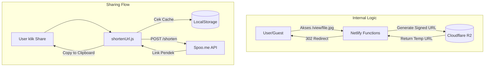

# Skema Share File & Folder (Media Share)

Dokumen ini menjelaskan mekanisme teknis bagaimana fitur berbagi (sharing) file dan folder bekerja pada proyek ini, termasuk integrasi layanan pemendek URL.

## 1. Sharing File

Fitur sharing file menggunakan sistem **Presigned URL** yang di-proxy melalui Netlify Functions.

### Alur Kerja:
1. **Endpoint**: User mengakses URL dengan format `/view/*` (misal: `/view/uploads/image.png`).
2. **Redirect**: File `public/_redirects` mengarahkan request tersebut ke `/.netlify/functions/share?key=:splat`.
3. **Backend Logic (`share.js`)**:
   - Mengambil `key` dari parameter URL.
   - Menghasilkan **Signed URL** menggunakan `getSignedUrl` dengan masa berlaku (TTL) **3600 detik (1 jam)**.
   - Melakukan redirect (HTTP 302) ke Signed URL tersebut.

---

## 2. Sharing Folder

Sharing folder diimplementasikan pada level antarmuka (Frontend) dengan memanfaatkan routing query parameter.

### Alur Kerja:
1. **Endpoint**: Link dibagikan dalam format `/?folder=nama-folder/`.
2. **Frontend Logic (`App.jsx`)**:
   - Membaca query parameter `folder`.
   - Memanggil fungsi `loadContents` untuk menampilkan isi folder yang dimaksud.

---

## 3. Integrasi URL Shortener (Spoo.me)

Untuk mempermudah berbagi, aplikasi mengintegrasikan API **Spoo.me** untuk memperpendek URL share.

### Mekanisme:
- **Client-Side Shortening**: Saat user mengklik tombol share, aplikasi mengirimkan URL asli ke API Spoo.me.
- **Caching**: Hasil URL pendek disimpan di `localStorage` berdasarkan URL aslinya untuk menghemat kuota rate limit API.
- **Fallback**: Jika API Spoo.me gagal atau mencapai rate limit, aplikasi akan otomatis menyalin URL asli ke clipboard.

---

## 4. Diagram Arsitektur Sharing

